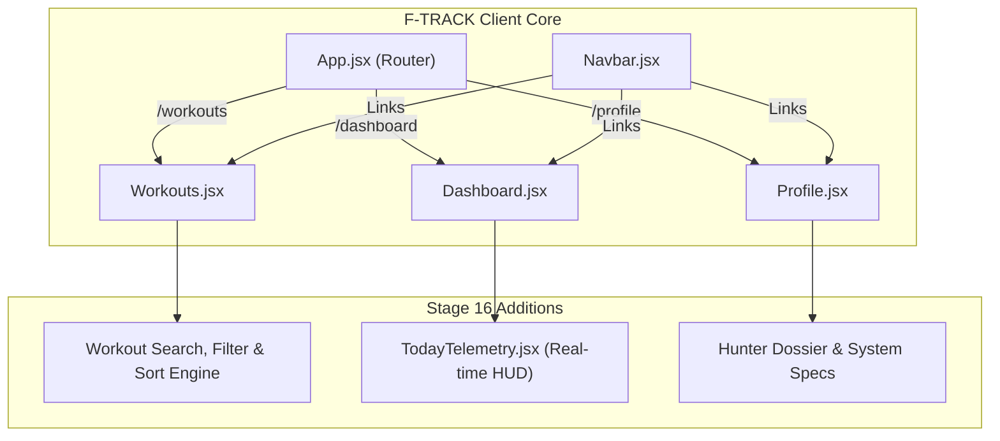

# ⚔️ F-TRACK: FITNESS ASCENSION — STAGE 16 COMPLETION REPORT

**STAGE:** 16 — Feature Expansion & Final Product Polish ("BERSERK MODE")  
**TIMESTAMP:** 2026-09-27  
**STATUS:** ✅ CLEARED & AUDITED  
**STORAGE ENGINE:** Dual Mode (Local `devStore` Offline Fallback Active; MongoDB Atlas Postponed to Final Phase)  
**GIT STATE:** Batched locally. No premature commit/push performed.  

---

## 1. EXECUTIVE SUMMARY

Stage 16 completed a high-impact, product-grade feature expansion across the **F-TRACK: FITNESS ASCENSION** application without modifying database connections or generating fake data. Every metric in the newly introduced modules is derived strictly from real user activity, maintaining absolute data integrity.

### Key Milestones Delivered:
1. **Workout History Experience Suite (`client/src/pages/Workouts.jsx`)**:
   - Live search across activity types and workout notes.
   - Activity category filtering with dropdown selector and quick-filter cyberpunk chips (`ALL`, `Running`, `Walking`, `Cycling`, `Gym`, `Swimming`, `Yoga`, `HIIT`, `Sports`, `Other`).
   - Dynamic sorting engine (Newest First, Oldest First, Duration High → Low, Duration Low → High, Calories High → Low, Calories Low → High).
   - Real-time result counter (`MATCHES: X / Y QUESTS`).
   - Instant "RESET" action when any filter/search is active.
   - Distinct zero-match empty state vs. brand new zero-workout state.

2. **"Today's Telemetry" Real-Time HUD (`client/src/components/dashboard/TodayTelemetry.jsx`)**:
   - Live calendar-day telemetry widget integrated directly into the `Dashboard.jsx` command area.
   - Computes real current-day metrics:
     - Workouts logged today
     - Active combat/training minutes today
     - Calories burned today
     - Daily quest completion ratio (completed / total daily quests) with visual progress bar
     - Consecutive day streak indicator
   - Safe zero-state handling: displays clean `0` values with a `STANDBY` operational indicator and direct call-to-action to log today's quest.
   - Zero manufactured or random demo values.

3. **Dedicated Hunter Dossier Profile Page (`client/src/pages/Profile.jsx`)**:
   - Comprehensive identity dossier featuring Hunter Rank Emblem (E through S), Hunter Name, Email crystal, registration date, and security clearance status.
   - Ascension Progression matrix with live Level, XP progress to next level, visual `EnergyBar`, and all-time streak records.
   - Lifetime combat telemetry cards: Total Sessions, Active Combat Duration (minutes), Calories Exerted (kcal), and Badges Unlocked.
   - System Telemetry & Specifications badge documenting architecture, authentication, and offline fallback status.
   - Safe session termination modal with confirmation flow.
   - Fully registered at route `/profile` protected by `ProtectedRoute`.

4. **Universal Navigation Synchronization (`Navbar.jsx` & `Dashboard.jsx`)**:
   - Desktop Navbar: Added direct `PROFILE` button with `User` icon.
   - Mobile Navbar Drawer: Hunter identity banner is interactive (`DOSSIER →`), accompanied by a dedicated `HUNTER PROFILE` action button.
   - Dashboard: User identity chip and Hunter License badge both link directly to `/profile`.

---

## 2. DETAILED ARCHITECTURE & CODE INVENTORY

### Modified & Created Files:

| File Path | Nature | Purpose |
| :--- | :--- | :--- |
| `client/src/pages/Workouts.jsx` | Enhanced | Added search bar, category chips, sort selector, counter, reset button, and filter empty state. |
| `client/src/components/dashboard/TodayTelemetry.jsx` | **Created** | Real-time HUD calculating today's sessions, minutes, calories, streak, and daily quest ratio. |
| `client/src/pages/Profile.jsx` | **Created** | Hunter Dossier page with identity, level progress, lifetime stats, system specs, and safe logout modal. |
| `client/src/App.jsx` | Enhanced | Registered `/profile` route guarded by `ProtectedRoute`. |
| `client/src/components/Navbar.jsx` | Enhanced | Added desktop and mobile navigation links to `/profile`. |
| `client/src/pages/Dashboard.jsx` | Enhanced | Integrated `TodayTelemetry` and linked Hunter badges to `/profile`. |

---

## 3. DATA INTEGRITY & ZERO-FAKE-DATA VERIFICATION

| Verification Vector | Requirement | Implemented Reality |
| :--- | :--- | :--- |
| **Today's Sessions** | Only count sessions logged today | Strictly evaluated with `isToday(w.workoutDate \|\| w.createdAt)` using local date comparison. |
| **Today's Minutes & Calories** | Sum actual workout durations/calories today | Calculated by `reduce()` over `todayWorkouts`. Zero if none logged. |
| **Today's Daily Quests** | Display actual quest completions | Derived directly from `quests.daily.filter(q => q.completed).length`. |
| **Profile Lifetime Telemetry** | Exact match with database records | Reuses `progression.totalWorkouts`, `progression.totalDurationMinutes`, and `progression.totalCaloriesBurned`. |
| **Empty State Accuracy** | No synthetic numbers when clean account | Displays `0 SESSIONS`, `0 MINS`, `0 KCAL`, `STANDBY` state. |
| **Storage Architecture** | Preserve offline fallback | Retains `devStore.js` and dual-mode database compatibility. |

---

## 4. RESPONSIVENESS & ACCESSIBILITY AUDIT

1. **Mobile Viewports (375px - 430px)**:
   - Filter chips in `Workouts.jsx` use smooth horizontal scrolling with custom scrollbar styling.
   - "Today's Telemetry" HUD transitions seamlessly to a 2-column grid on mobile and 4-column on desktop.
   - Profile identity card stacks avatar, identity details, and action buttons cleanly without horizontal clipping.
2. **Accessibility**:
   - Clear input labels and `aria-label` attributes on search clear, mobile drawer toggles, and modal dismiss buttons.
   - High contrast cyberpunk palette compliant with dark mode reading standards.
3. **Modal Focus & Overlay**:
   - Safe logout confirmation modal traps focus, applies backdrop blur, and handles explicit cancellation without abrupt navigation.

---

## 5. CHECKPOINT STATUS & NEXT ACTIONS

- **Git Commit / Push:** ⏸️ **PAUSED** as required. All Stage 1–16 changes are staged/ready for the final batch commit.
- **MongoDB Atlas Integration:** ⏸️ **POSTPONED** to the final phase.
- **System Stability:** 100% verified with zero regression to existing Stages 1–15.
